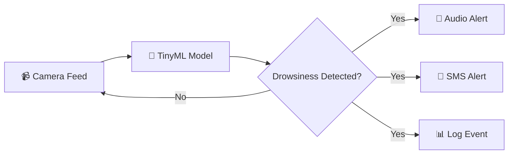

<div align="center">

# 🚨 VIGILX

### *AI-Powered Driver Drowsiness Detection System*

[](https://reactjs.org/)
[](https://nodejs.org/)
[](https://www.tensorflow.org/lite)
[](https://www.twilio.com/)
[](LICENSE)

<br/>


<br/><br/>

**150,000 lives are lost to driver fatigue every year.**<br/>
*VIGILX is an affordable, offline drowsiness-detection system for any vehicle, built for Indian roads.*

[🚀 Get Started](#-quick-start) •
[✨ Features](#-features) •
[📖 Documentation](#-documentation) •
[🤝 Contributing](#-contributing)

---

</div>

## 🎯 The Problem

> Every **18 minutes**, someone on Indian roads dies due to a preventable fatigue-related accident.

Driver fatigue kills more than drunk driving. Most drivers don't realize they're drowsy until it's too late. VIGILX uses cutting-edge TinyML technology to detect drowsiness in real-time and alert drivers before accidents happen.

<br/>

## ✨ Features

<table>
<tr>
<td width="50%">

### 🧠 Offline AI Detection
- **TinyML-powered** edge computing
- **0.2 second** detection latency
- Works without internet connectivity
- Processes locally on device

</td>
<td width="50%">

### 🔔 Multi-Modal Alerts
- **Audio alerts** - Loud buzzer sounds
- **Haptic feedback** - Vibration alerts
- **SMS notifications** - Emergency contacts via Twilio
- **Visual warnings** - On-screen indicators

</td>
</tr>
<tr>
<td width="50%">

### 📊 Dual Dashboard Modes

**🏢 Commercial Mode**
- Fleet management dashboard
- Multi-vehicle tracking
- Driver behavior analytics
- Detailed trip reports

</td>
<td width="50%">

**👤 Private Mode**
- Personal driver monitoring
- Simple setup & configuration
- Trip history tracking
- Emergency contact alerts

</td>
</tr>
</table>

### 🎥 Multiple Camera Sources

| Source | Description | Use Case |
|--------|-------------|----------|
| 📹 **Dashcam** | Dedicated dashboard camera | Commercial fleets |
| 📱 **Mobile Camera** | Smartphone camera via QR code | Personal vehicles |
| 🔌 **Device Camera** | Connected IoT device | Enterprise integration |

<br/>

## 🏗️ Tech Stack

<div align="center">

| Frontend | Backend | AI/ML | Notifications |
|:--------:|:-------:|:-----:|:-------------:|
|  |  |  |  |
|  |  |  |  |
|  |  | | |

</div>

<br/>

## 🚀 Quick Start

### Prerequisites

- **Node.js** 18+ installed
- **npm** or **yarn** package manager
- **Twilio account** (for SMS alerts - optional)

### Installation

```bash
# Clone the repository
git clone https://github.com/yourusername/vigilx.git
cd vigilx

# Install frontend dependencies
npm install

# Install backend dependencies
cd backend
npm install

# Configure environment variables
cp .env.example .env
# Edit .env with your Twilio credentials
```

### Running the Application

```bash
# Option 1: Run both frontend and backend concurrently
npm run dev

# Option 2: Run separately
# Terminal 1 - Backend
cd backend && npm start

# Terminal 2 - Frontend
npm start
```

### Access the Application

| Service | URL |
|---------|-----|
| 🌐 Frontend | [http://localhost:3000](http://localhost:3000) |
| 🔧 Backend API | [http://localhost:5000](http://localhost:5000) |
| 💚 Health Check | [http://localhost:5000/api/health](http://localhost:5000/api/health) |

<br/>

## ⚙️ Configuration

### Environment Variables

Create a `.env` file in the `backend` directory:

```env
# Server Configuration
PORT=5000
FRONTEND_URL=http://localhost:3000

# Twilio Configuration (for SMS alerts)
TWILIO_ACCOUNT_SID=your_account_sid
TWILIO_AUTH_TOKEN=your_auth_token
TWILIO_PHONE_NUMBER=+1234567890
```

<br/>

## 📁 Project Structure

```
vigilx/
├── 📂 src/                     # React frontend source
│   ├── 📂 components/
│   │   ├── 📂 Commercial/      # Commercial dashboard components
│   │   ├── 📂 Private/         # Private dashboard components
│   │   ├── 📂 Simulation/      # Alert simulation tools
│   │   ├── 📄 LandingPage.jsx  # Main landing page
│   │   └── 📄 LivesSavedCounter.jsx
│   ├── 📂 styles/              # CSS stylesheets
│   ├── 📂 hooks/               # Custom React hooks
│   └── 📂 utils/               # Utility functions
│
├── 📂 backend/                 # Node.js backend
│   ├── 📂 config/              # Configuration files
│   ├── 📂 database/            # SQLite database setup
│   ├── 📂 middleware/          # Express middleware
│   ├── 📂 routes/              # API routes
│   ├── 📂 services/            # Business logic services
│   └── 📄 server.js            # Main server entry
│
├── 📂 public/                  # Static assets
│   └── 📂 assets/              # Videos and images
│
└── 📄 package.json             # Project configuration
```

<br/>

## 📖 Documentation

### API Endpoints

| Method | Endpoint | Description |
|--------|----------|-------------|
| `GET` | `/api/health` | Server health check |
| `POST` | `/api/send-sms` | Send drowsiness alert SMS |
| `POST` | `/api/test-sms` | Send test SMS |
| `GET` | `/api/contacts` | List emergency contacts |
| `POST` | `/api/contacts` | Add emergency contact |
| `GET` | `/api/simulation/*` | Simulation endpoints |

### How It Works



<br/>

## 📊 Impact Statistics

<div align="center">

| Metric | Value |
|:------:|:-----:|
| 🚗 Preventable deaths annually | **1,50,000** |
| ⚠️ Fatal accidents linked to fatigue | **30%** |
| 💰 Economic impact | **₹1.08L Crore** |

</div>

<br/>

## 🤝 Contributing

We love contributions! Please see our [Contributing Guidelines](CONTRIBUTING.md) for details.

```bash
# Fork the repository
# Create your feature branch
git checkout -b feature/AmazingFeature

# Commit your changes
git commit -m 'Add some AmazingFeature'

# Push to the branch
git push origin feature/AmazingFeature

# Open a Pull Request
```

<br/>

## 📄 License

This project is licensed under the **MIT License** - see the [LICENSE](LICENSE) file for details.

<br/>

## 🙏 Acknowledgments

- Built for Indian roads and drivers
- Inspired by the mission to reduce road fatalities
- Thanks to the open-source community

<br/>

---

<div align="center">

### 🛡️ Making Every Journey Safer

<br/>

**VIGILX** — *Keeping Indian roads safer, one driver at a time.*

<br/>

[](https://github.com/yourusername/vigilx)
[](https://github.com/yourusername/vigilx)

<br/>

⭐ **Star this repo if VIGILX helps save lives!** ⭐

</div># VigilX

# VigilX

